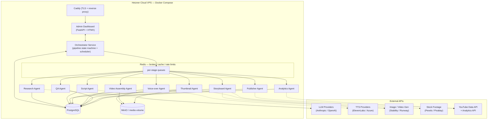
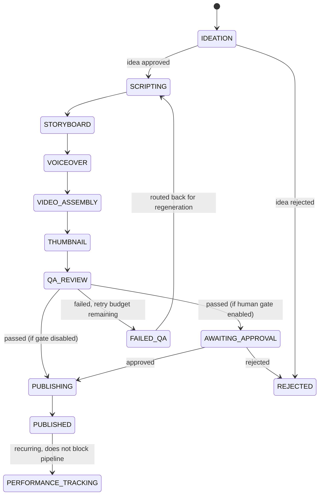

# 1. System Architecture

## 1.1 Overview

The system is a pipeline of independent **agents**, each responsible for one
production stage, coordinated by a central **Orchestrator**. Agents communicate
only through the **task queue** (Redis) and the **database** (PostgreSQL) — never
directly with each other. This keeps the system loosely coupled: any agent's
container can be rebuilt, restarted, or replaced without touching the others.

A video moves through the pipeline as a **Project**, a row that tracks which
stage it's in, its status, and links to every artifact produced along the way
(script, audio, video, thumbnail, QA report, publication record).

## 1.2 Component diagram

## 1.3 Pipeline state machine

Each `project` moves through a linear sequence of stages. The Orchestrator is the
only component allowed to advance a project's stage; agents report completion or
failure, they do not self-advance the pipeline.

`FAILED_QA` routes back to the stage the QA report identifies as the likely
cause (e.g. audio sync issues → `VOICEOVER`, factual/policy issues →
`SCRIPTING`), bounded by a per-project `retry_count` to prevent infinite loops.
Once the retry budget is exhausted, the project moves to `NEEDS_HUMAN_REVIEW`
and generates an alert instead of retrying silently.

## 1.4 Orchestration pattern: centralized, not choreographed

Two designs were considered:

- **Choreography**: each agent, on success, enqueues the next stage directly.
  Simple at first, but pipeline logic ends up scattered across every agent, and
  there is no single place to see "what should happen next" or to change the
  pipeline shape.
- **Orchestration (chosen)**: agents only ever do work and report a result
  (success + output, or failure + error) onto a `results` queue / via an internal
  callback API. The Orchestrator is the only place that decides the next stage,
  applies retry policy, and enforces approval gates.

This trades a small amount of latency (one extra hop through the Orchestrator)
for centralized observability and the ability to change pipeline behavior
(retry limits, gate toggles, stage skipping) in one place.

## 1.5 Runtime request/data flow (single video)

1. **Scheduler** (Celery beat, inside the Orchestrator container) triggers a
   daily ideation run per channel.
2. **Orchestrator** enqueues a `research` job with channel config as payload.
3. **Research Agent** pulls trend signals, scores candidate ideas via LLM, writes
   `video_ideas` rows, reports completion.
4. **Orchestrator** either auto-approves top-scored ideas (config-driven) or
   marks them `proposed` for human approval via the dashboard.
5. On approval, **Orchestrator** creates a `projects` row and enqueues `script`.
6. Each subsequent agent (`storyboard` → `voiceover` → `video_assembly` →
   `thumbnail` → `qa`) is invoked the same way: dequeue → do work → write
   artifacts to `assets`/domain tables + object storage → report result.
7. **QA Agent** gates progression to `publishing`.
8. **Publisher Agent** uploads to YouTube via the Data API, stores the returned
   `youtube_video_id` in `publications`.
9. **Analytics Agent** runs on its own recurring schedule (independent of the
   per-video pipeline) pulling metrics for every `PUBLISHED` project and writing
   time-series rows to `performance_metrics`.
10. Aggregated performance data feeds back into the Research Agent's scoring
    model (see roadmap, Phase 4) — the system's learning loop.

## 1.6 Deployment topology (Hetzner VPS)

- Single Docker Compose stack on one VPS (recommended starting point: Hetzner
  **CCX23** or **CPX41** — 4–8 dedicated/shared vCPUs, 16 GB RAM; video assembly
  is the most CPU/RAM-hungry stage and dictates sizing).
- **Caddy** (or Traefik) terminates TLS for the admin dashboard, using a
  Hetzner-managed DNS record; the pipeline itself has no public-facing API
  surface beyond OAuth callback endpoints needed for YouTube auth.
- **PostgreSQL** and **Redis** run as Compose services with named volumes;
  **MinIO** (S3-compatible) runs as a Compose service backed by a Hetzner
  Volume, giving an object-storage interface from day one even though
  everything lives on one box — this makes a later move to Hetzner Object
  Storage or AWS S3 a config change (endpoint + credentials) rather than a
  rewrite.
- Nightly `pg_dump` + MinIO bucket sync to off-VPS storage (Hetzner Storage
  Box or Backblaze B2) via a `backup` sidecar/cron container — see
  [Roadmap, Phase 5](./06-roadmap.md).
- All secrets (API keys, OAuth client secrets, DB password) are supplied via a
  `.env` file excluded from git and consumed through Pydantic Settings; Docker
  Compose `secrets:` can replace this later if multi-host deployment is ever
  needed.
- Each agent is its own Compose service/image so it can be scaled
  independently (`docker compose up --scale agent_video_assembly=2`) and so a
  crash or dependency upgrade in one agent (e.g. an ffmpeg version bump) never
  requires rebuilding the others.

## 1.7 Failure handling & idempotency

- Every unit of work is a row in `jobs` before it is dispatched. If the process
  crashes mid-task, the job stays `running`; a watchdog (Celery's own
  visibility timeout plus an Orchestrator sweep) requeues jobs stuck beyond a
  timeout.
- Agents are written to be **idempotent per job id**: re-running a job with the
  same id overwrites/upserts its output artifacts rather than creating
  duplicates (critical for the Publisher Agent, where a duplicate run must
  never double-upload a video).
- Provider calls (LLM/TTS/image/video) go through a shared retry+backoff
  wrapper in `libs/providers`, with circuit-breaking to a fallback provider
  after N consecutive failures (see [Technology Choices](./05-technology-choices.md)).
- All exceptions are captured with structured context (project id, stage,
  provider, attempt number) and shipped to Sentry; a Telegram/Slack webhook
  notifies on anything that exhausts its retry budget.
