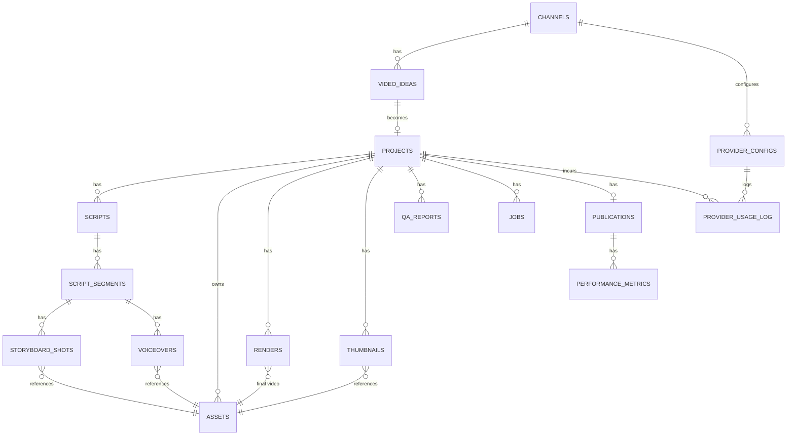

# 4. Database Design

PostgreSQL 16, accessed via SQLAlchemy 2.0 (async) with Alembic migrations as
the single source of truth for schema. `pgvector` extension is enabled for
idea-deduplication embeddings.

## 4.1 Entity relationship diagram

## 4.2 Core tables

### `channels`
The top-level entity — supports multi-channel operation from day one even if
only one is used initially.

| column | type | notes |
|---|---|---|
| id | uuid PK | |
| name | text | |
| niche | text | |
| persona_config | jsonb | tone, banned topics, cadence, style guide |
| youtube_channel_id | text | |
| is_active | boolean | |
| created_at | timestamptz | |

### `video_ideas`
| column | type | notes |
|---|---|---|
| id | uuid PK | |
| channel_id | uuid FK → channels | |
| title | text | |
| description | text | |
| keywords | text[] | |
| source | text | e.g. `youtube_trending`, `google_trends`, `manual` |
| score | numeric | ranking output from Research Agent |
| rationale | text | why the LLM scored it this way |
| embedding | vector(1536) | pgvector, for dedup against past ideas/videos |
| status | enum | `proposed`, `approved`, `rejected` |
| created_at | timestamptz | |

### `projects`
The central pipeline-instance row.

| column | type | notes |
|---|---|---|
| id | uuid PK | |
| channel_id | uuid FK → channels | |
| idea_id | uuid FK → video_ideas | |
| current_stage | enum | matches the pipeline state machine (§1.3) |
| status | enum | `pending`, `in_progress`, `failed`, `needs_human_review`, `completed`, `cancelled` |
| retry_count | int | bounds `FAILED_QA` loop-backs |
| priority | int | |
| created_at / updated_at | timestamptz | |

### `scripts` / `script_segments`
| `scripts` | | |
|---|---|---|
| id | uuid PK | |
| project_id | uuid FK → projects | |
| version | int | scripts are versioned, not overwritten |
| content | text | full script |
| tone | text | |
| target_duration_sec | int | |
| word_count | int | |
| status | enum | `draft`, `approved`, `superseded` |
| created_at | timestamptz | |

| `script_segments` | | |
|---|---|---|
| id | uuid PK | |
| script_id | uuid FK → scripts | |
| order_index | int | |
| text | text | |
| estimated_duration_sec | int | |
| scene_notes | text | |

### `storyboard_shots`
| column | type | notes |
|---|---|---|
| id | uuid PK | |
| script_segment_id | uuid FK → script_segments | |
| shot_type | enum | `stock`, `ai_image`, `ai_video`, `text_overlay` |
| prompt_or_query | text | |
| asset_id | uuid FK → assets, nullable | resolved once sourced/generated |
| order_index | int | |

### `assets`
Generic artifact table — every media file the pipeline produces or sources
lives here, pointing at object storage (MinIO/S3), not at the database.

| column | type | notes |
|---|---|---|
| id | uuid PK | |
| project_id | uuid FK → projects | |
| type | enum | `audio`, `image`, `video`, `music`, `caption` |
| provider | text | which provider/source produced it, `null` for uploads |
| storage_path | text | object-storage key/URL |
| checksum | text | integrity check + idempotency guard |
| duration_sec | numeric | nullable, audio/video only |
| metadata | jsonb | provider-specific params (voice id, model, prompt, resolution) |
| created_at | timestamptz | |

### `voiceovers`, `renders`, `thumbnails`
Thin join tables linking a stage's output to an `assets` row plus
stage-specific metadata (voice id/provider for `voiceovers`; render engine and
final duration for `renders`; `is_selected` flag and A/B variant label for
`thumbnails`).

### `qa_reports`
| column | type | notes |
|---|---|---|
| id | uuid PK | |
| project_id | uuid FK → projects | |
| stage | text | which stage's output was checked |
| passed | boolean | |
| issues | jsonb | itemized list: `{category, severity, detail}` |
| checked_at | timestamptz | |

### `jobs`
The execution/audit log — every agent invocation, without exception. This is
what makes retries, debugging, and observability possible.

| column | type | notes |
|---|---|---|
| id | uuid PK | |
| project_id | uuid FK → projects, nullable | null for channel-level jobs (ideation) |
| agent_name | text | |
| queue_name | text | |
| status | enum | `queued`, `running`, `succeeded`, `failed`, `retrying` |
| attempt_count | int | |
| max_attempts | int | |
| payload | jsonb | job input, matches `libs/schemas` contract |
| result | jsonb | |
| error | text | |
| started_at / finished_at | timestamptz | |

### `publications`
| column | type | notes |
|---|---|---|
| id | uuid PK | |
| project_id | uuid FK → projects | |
| youtube_video_id | text | |
| publish_status | enum | `scheduled`, `published`, `failed` |
| scheduled_at / published_at | timestamptz | |
| privacy_status | text | |
| title / description | text | as actually submitted (may differ from script's working title) |
| tags | text[] | |

### `performance_metrics`
Time-series, one row per publication per day — candidate for monthly range
partitioning once volume grows.

| column | type | notes |
|---|---|---|
| id | uuid PK | |
| publication_id | uuid FK → publications | |
| metric_date | date | |
| views, likes, comments, subscribers_gained | int | |
| watch_time_minutes, avg_view_duration_sec | numeric | |
| impressions, ctr | numeric | |
| retrieved_at | timestamptz | |

### `provider_configs`
Drives *per-channel* provider selection — which concrete provider backs each
AI capability for a given channel, in priority order (for fallback). This
is a different, complementary layer to `config/providers.yaml`
(`libs/providers/registry.py`): the YAML file declares *which
implementations exist* as importable classes and the process-wide
default; this table tracks a per-channel *active choice* by name among
whatever the YAML defines, plus usage/cost logging below. `provider_name`
here is expected to match a name declared for that capability in the YAML.

| column | type | notes |
|---|---|---|
| id | uuid PK | |
| capability | enum | `llm`, `tts`, `image_gen`, `video_gen`, `stock_media` |
| provider_name | text | e.g. `anthropic`, `elevenlabs` |
| is_active | boolean | |
| priority_order | int | lower = tried first |
| config | jsonb | model name, voice id, generation params |
| secret_ref | text | **name of the env var / secret holding the API key — never the key itself** |

### `provider_usage_log`
Per-call cost/usage tracking, keyed to `provider_configs`, for spend
attribution per project and per provider.

### `system_events` (audit log)
Generic append-only event log (`entity_type`, `entity_id`, `event_type`,
`payload jsonb`, `created_at`) for anything not covered by `jobs` — approval
decisions, config changes, manual overrides.

### `users`
Auth for the internal admin dashboard (`email`, `hashed_password`, `role`,
`created_at`) — not customer-facing, just operator access control.

## 4.3 Indexing strategy

- `projects(status, current_stage)` — the Orchestrator's primary polling query.
- `jobs(status, queue_name)` — for the stuck-job sweep.
- `performance_metrics(publication_id, metric_date)` — composite, for
  time-series lookups and the eventual range partitioning key.
- `video_ideas` embedding column gets an `ivfflat` (pgvector) index for
  approximate nearest-neighbor dedup lookups.
- Foreign keys throughout get standard btree indexes (SQLAlchemy/Alembic
  default) to keep join-heavy dashboard queries fast.

## 4.4 Design notes

- **JSONB for anything provider-specific or still evolving** (`metadata`,
  `config`, `issues`, `payload`/`result`) — avoids a migration every time a new
  provider or QA check adds a field, while core relational fields (ids,
  status, timestamps) stay strongly typed and indexable.
- **No raw secrets in the database, ever** — `provider_configs.secret_ref`
  points at an environment variable name; the actual key lives in `.env` /
  Docker secrets, consistent with the config-management approach in
  [Technology Choices](./05-technology-choices.md).
- **Scripts are versioned rows, not mutated in place** — needed both for QA
  regeneration loops (a failed script gets a new version, not an overwrite)
  and for later analysis of what changed between a rejected and an approved
  draft.
