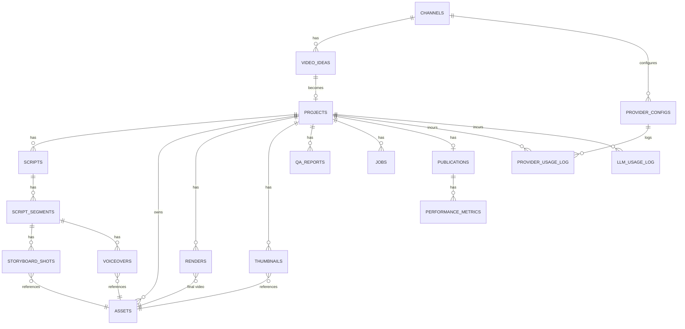

# 4. Database Design

PostgreSQL 16, accessed via SQLAlchemy 2.0 (async) with Alembic migrations as
the single source of truth for schema. `pgvector` extension is enabled for
idea-deduplication embeddings.

## 4.1 Entity relationship diagram

## 4.2 Core tables

### `channels`
The top-level entity — supports multi-channel operation from day one even if
only one is used initially.

| column | type | notes |
|---|---|---|
| id | uuid PK | |
| name | text | |
| niche | text | |
| persona_config | jsonb | tone, banned topics, cadence, style guide |
| youtube_channel_id | text | |
| is_active | boolean | |
| created_at | timestamptz | |

### `video_ideas`
| column | type | notes |
|---|---|---|
| id | uuid PK | |
| channel_id | uuid FK → channels | |
| title | text | the idea's topic |
| description | text | unused today — left for a fuller synopsis later |
| keywords | text[] | |
| source | text | `goal` (human-submitted), `research_agent` (discover mode) |
| score | numeric | 0-100 confidence from the Research Agent, capped when flagged as a likely duplicate |
| rationale | text | why people would watch this |
| target_audience | text | who specifically would watch this |
| suggested_angle | text | the creative hook, not a restatement of the topic |
| competition_level | enum | `low`, `medium`, `high` — how saturated this angle already is on YouTube, not production difficulty |
| suggested_length_sec | int | |
| research_notes | text | what informed the idea — trend signals, tradeoffs, duplicate-content warnings |
| knowledge_package_json_path | text | path (via `libs.storage`, not the content) to the Research Agent's deep-research Knowledge Package — see `libs/schemas/knowledge.py`. Null until enrich mode builds one; discover mode never does |
| knowledge_package_md_path | text | the same package rendered as Markdown, generated from the JSON, never authored separately |
| embedding | vector(1536) | pgvector — stays null today; no embedding provider is wired in yet, so duplicate detection is a lexical heuristic instead (services/agent_research/app/dedup.py) |
| status | enum | `proposed`, `approved`, `rejected` |
| created_at | timestamptz | |

### `projects`
The central pipeline-instance row.

| column | type | notes |
|---|---|---|
| id | uuid PK | |
| channel_id | uuid FK → channels | |
| idea_id | uuid FK → video_ideas | |
| current_stage | enum | matches the pipeline state machine (§1.3) |
| status | enum | `pending`, `in_progress`, `failed`, `needs_human_review`, `completed`, `cancelled` |
| retry_count | int | bounds `FAILED_QA` loop-backs |
| priority | int | |
| created_at / updated_at | timestamptz | |

### `scripts` / `script_segments`
Written by the Script Agent (`services/agent_scriptwriter`) — see
[Agent Responsibilities §3.3](./03-agent-responsibilities.md).

| `scripts` | | |
|---|---|---|
| id | uuid PK | |
| project_id | uuid FK → projects | |
| version | int | scripts are versioned, not overwritten — a regeneration gets `max(existing)+1` |
| content | text | full narration, every segment's `text` concatenated in order |
| tone | text | |
| target_duration_sec | int | |
| word_count | int | |
| structure_notes | text, nullable | the story structure chosen (e.g. "problem → agitation → solution") and why |
| retention_notes | text, nullable | the concrete retention techniques used and where (open loops, pattern interrupts, callbacks) |
| review_notes | text, nullable | what the self-review pass (`script_reviewer.py`) checked/changed, or why review was skipped |
| status | enum | `draft`, `approved`, `superseded` |
| created_at | timestamptz | |

| `script_segments` | | |
|---|---|---|
| id | uuid PK | |
| script_id | uuid FK → scripts | |
| order_index | int | |
| segment_type | enum | `hook`, `introduction`, `main_section`, `ending`, `call_to_action` |
| text | text | voice-over narration for this beat |
| estimated_duration_sec | int | word count ÷ this beat's own `production_metadata.estimated_speech_wpm` (clamped 80-220); the Video Agent's Voice Generation module supersedes this with the actual synthesized audio's real duration |
| scene_notes | text | what's happening on screen during this beat (main sections are prefixed with their internal heading) |
| visual_notes | text, nullable | concrete visual/b-roll/on-screen-text suggestions — distinct from `scene_notes` |
| production_metadata | jsonb | structured per-beat production metadata the Video Agent consumes directly — see below |

`production_metadata` (validated against
`libs/schemas/script_production.py`'s `SegmentProductionMetadata` before
it's ever written, and parsed back out the same way by the Video Agent's
Asset Planning module) — one column, not one per field, since the Video
Agent always reads the whole bundle together for a beat and never
filters segments by an individual field via
SQL (same reasoning as `Channel.persona_config`):

| key | type | notes |
|---|---|---|
| camera_framing | string | free text (e.g. "wide shot", "close-up", "over-the-shoulder") |
| asset_requirements | object[] | every concrete production asset this beat needs — see below |
| transition_type | enum | `cut` / `fade` / `dissolve` / `wipe` / `zoom` / `slide` / `match_cut` |
| pacing | enum | `fast` / `medium` / `slow` — editing rhythm, independent of narration speed |
| narration_emotion | string | free text (e.g. "curious", "urgent", "reassuring") |
| emphasis_words | string[] | words/phrases in this beat's `text` worth vocal or caption emphasis |
| estimated_speech_wpm | int | this beat's own narration speed (80-220), used to derive `estimated_duration_sec` |

`asset_requirements` is a *provider-independent* list — it declares what
kind of asset a beat needs and what it should contain, never which
concrete provider/tool supplies it (that's the Video Agent's Asset
Planning/Asset Generation modules' decision, via `libs.providers` — see
[Agent Responsibilities §3.4](./03-agent-responsibilities.md#34-video-agent)).
Each entry:

| key | type | notes |
|---|---|---|
| asset_type | enum | one of `ai_video`, `ai_image`, `stock_footage`, `animation`, `diagram`, `map`, `portrait`, `text_overlay`, `subtitle_emphasis`, `sound_effect`, `background_music_cue` |
| description | string | what it should actually show/sound like, in content terms (never a provider/tool name) |

Every beat must have at least one entry whose `asset_type` is a visual
type (anything except `sound_effect`/`background_music_cue`) — since
every beat's `scene_description`/`visual_suggestions` always describes a
visual (both are required fields), it must always have something
declared to realize it. This is enforced in code
(`script_schema.py`'s `_validate_asset_coverage`), not just requested in
the prompt: `script_generator.py` raises `ScriptGenerationError` if a
draft fails it, `script_reviewer.py` falls back to the prior draft if its
own revision does.

Distinct from `libs.models.enums.ShotType` (used by
`storyboard_shots.shot_type`, below): that's the narrower vocabulary the
Video Agent's Asset Planning module (`ASSET_TYPE_ROUTING` in
services/agent_video/app/pipeline_schema.py) resolves one concrete
*visual* shot into, translating a visual `asset_requirements` entry down
to the four values `ShotType` distinguishes.

### `storyboard_shots`
Written by the Video Agent's Asset Generation module for every *visual*
planned asset (see [Agent Responsibilities §3.4](./03-agent-responsibilities.md#34-video-agent)) —
never for the two audio-only asset types (`sound_effect`,
`background_music_cue`), which have no per-shot concept.

| column | type | notes |
|---|---|---|
| id | uuid PK | |
| script_segment_id | uuid FK → script_segments | |
| shot_type | enum | `stock`, `ai_image`, `ai_video`, `text_overlay` — what a script segment's richer 11-value `asset_type` (libs/schemas/script_production.py) collapses to for a resolved visual shot |
| prompt_or_query | text | the asset requirement's `description` |
| asset_id | uuid FK → assets, nullable | resolved once sourced/generated; permanently null for a `text_overlay` shot, which is composited directly at render time rather than as a separate file |
| order_index | int | position within this segment's own requirements list — a segment can plan more than one shot |

### `assets`
Generic artifact table — every media file the pipeline produces or sources
lives here, pointing at object storage (MinIO/S3), not at the database.

| column | type | notes |
|---|---|---|
| id | uuid PK | |
| project_id | uuid FK → projects | |
| type | enum | `audio`, `image`, `video`, `music`, `caption` |
| provider | text | which provider/source produced it, `null` for uploads |
| storage_path | text | object-storage key/URL |
| checksum | text | integrity check + idempotency guard |
| duration_sec | numeric | nullable, audio/video only |
| metadata | jsonb | provider-specific params (voice id, model, prompt, resolution). Also how the Video Agent's Asset Generation module links a supplementary-audio asset (`sound_effect`/`background_music_cue` — physical type `audio`/`music`) back to the segment/requirement it came from (`{"segment_id", "requirement_index", "script_asset_type"}`), since — unlike visual shots — those have no `storyboard_shots`-style join table of their own. |
| created_at | timestamptz | |

### `voiceovers`, `renders`, `thumbnails`
Thin join tables linking a stage's output to an `assets` row plus
stage-specific metadata (voice id/provider for `voiceovers`; render engine and
final duration for `renders`; `is_selected` flag and A/B variant label for
`thumbnails`). `voiceovers` is written by the Video Agent's Voice Generation
module; `renders` by its Rendering module, via the `editor` capability's real
ffmpeg-based compositor (§3.4); `thumbnails` by its Thumbnail Generation
module — one variant per project today (`is_selected` always true), automated
A/B variant testing being a later phase (§6, Phase 4).

### `asset_cache_entries`
The Video Agent's Asset Cache index (`services/agent_video/app/asset_cache.py`,
§3.4) — deliberately **not** an `assets`-adjacent table: no foreign key to
`projects` or `assets` at all, so it survives any one project's deletion and
is shared across every project rather than scoped to one. `cache_key` is a
SHA-256 hash of the semantic request (capability, provider, prompt,
resolution/duration/style/language/settings) that produced `storage_path`;
Asset Generation and Voice Generation look up this table before calling a
provider, and every project that hits the same key reuses the same
`storage_path` in its own `assets` row.

| column | type | notes |
|---|---|---|
| id | uuid PK | |
| cache_key | text(64), unique | hex SHA-256 digest of the canonical request payload |
| capability | text | `image_gen`, `video_gen`, `stock_media`, `audio_library`, `tts` |
| provider_name | text | which provider actually produced these bytes — not necessarily today's configured one for this capability |
| asset_type | text | the requesting side's own asset-type vocabulary (a Script Agent `AssetType` value, or `narration` for TTS) |
| physical_asset_type | enum | reuses `assets.type`'s `asset_type` enum (`audio`/`image`/`video`/`music`/`caption`) |
| storage_path | text | object-storage key, under a dedicated cache namespace, never a real project's |
| metadata | jsonb | capability-specific data a hit needs to avoid recalling the provider — e.g. TTS's `duration_sec`/`word_timings`; empty when the stored bytes are themselves the whole answer |
| hit_count | int | incremented on every cache hit |
| last_used_at | timestamptz | updated on every cache hit |
| created_at | timestamptz | |

Writing a new entry (`AssetCache.put`) tolerates losing a race to another
worker caching the same key concurrently — the unique-constraint violation
on `cache_key` is caught and logged rather than raised, since the caller's
own freshly produced bytes are already valid to use regardless of which
worker's index row wins.

### `qa_reports`
| column | type | notes |
|---|---|---|
| id | uuid PK | |
| project_id | uuid FK → projects | |
| stage | text | which stage's output was checked |
| passed | boolean | |
| issues | jsonb | itemized list: `{category, severity, detail}` |
| checked_at | timestamptz | |

### `jobs`
The execution/audit log — every agent invocation, without exception. This is
what makes retries, debugging, and observability possible.

| column | type | notes |
|---|---|---|
| id | uuid PK | |
| project_id | uuid FK → projects, nullable | null for channel-level jobs (ideation) |
| agent_name | text | |
| queue_name | text | |
| status | enum | `queued`, `running`, `succeeded`, `failed`, `retrying` |
| attempt_count | int | |
| max_attempts | int | |
| payload | jsonb | job input, matches `libs/schemas` contract |
| result | jsonb | |
| error | text | |
| started_at / finished_at | timestamptz | |

### `publications`
| column | type | notes |
|---|---|---|
| id | uuid PK | |
| project_id | uuid FK → projects | |
| youtube_video_id | text | |
| publish_status | enum | `scheduled`, `published`, `failed` |
| scheduled_at / published_at | timestamptz | |
| privacy_status | text | |
| title / description | text | as actually submitted (may differ from script's working title) |
| tags | text[] | |

### `performance_metrics`
Time-series, one row per publication per day — candidate for monthly range
partitioning once volume grows.

| column | type | notes |
|---|---|---|
| id | uuid PK | |
| publication_id | uuid FK → publications | |
| metric_date | date | |
| views, likes, comments, subscribers_gained | int | |
| watch_time_minutes, avg_view_duration_sec | numeric | |
| impressions, ctr | numeric | |
| retrieved_at | timestamptz | |

### `provider_configs`
Drives *per-channel* provider selection — which concrete provider backs each
AI capability for a given channel, in priority order (for fallback). This
is a different, complementary layer to `config/providers.yaml`
(`libs/providers/registry.py`): the YAML file declares *which
implementations exist* as importable classes and the process-wide
default; this table tracks a per-channel *active choice* by name among
whatever the YAML defines, plus usage/cost logging below. `provider_name`
here is expected to match a name declared for that capability in the YAML.

| column | type | notes |
|---|---|---|
| id | uuid PK | |
| capability | enum | `llm`, `tts`, `image_gen`, `video_gen`, `stock_media`, `audio_library` |
| provider_name | text | e.g. `anthropic`, `elevenlabs` |
| is_active | boolean | |
| priority_order | int | lower = tried first |
| config | jsonb | model name, voice id, generation params |
| secret_ref | text | **name of the env var / secret holding the API key — never the key itself** |

### `provider_usage_log`
Per-call cost/usage tracking, keyed to `provider_configs`, for spend
attribution per project and per provider.

### `llm_usage_log`
One row per LLM API call, written by `libs.llm_usage.track_llm_call` — every
Claude call site in this codebase (`reasoning.py`, `idea_generator.py`,
`knowledge_builder.py`) wraps its call with it, success or failure alike, for
future analytics/optimization. Deliberately a separate table from
`provider_usage_log` above: that table is keyed to a `provider_configs` row
(the DB-driven, swappable-vendor system for video/TTS/image/YouTube), which
none of this table's call sites have, since they all call the Anthropic SDK
directly rather than going through `libs.providers`.

| column | type | notes |
|---|---|---|
| id | uuid PK | |
| project_id | uuid FK, nullable | `ON DELETE SET NULL` — usage history outlives project deletion, same as `provider_usage_log.project_id` |
| agent_name | text | e.g. `manager`, `research` |
| call_site | text | e.g. `reasoning.decide`, `knowledge_builder.build` — one call site can log multiple rows per invocation (see below) |
| provider | text | `anthropic` today |
| model | text | the concrete model id called |
| prompt_name, prompt_version | text, nullable | the concrete resolved version (e.g. `v1`), never the literal `"latest"` |
| input_tokens, output_tokens | int, nullable | null when the call failed before a response came back |
| elapsed_ms | int | wall-clock time for the call |
| cost_estimate_usd | numeric(10,6), nullable | from `libs.llm_usage.pricing`'s per-model rate table; null for an unknown model or missing token counts, never a guessed number |
| success | boolean | |
| error | text, nullable | |
| called_at | timestamptz | |

`knowledge_builder.build`'s web-search-backed call can pause mid-turn
(`stop_reason: "pause_turn"`) and resend the conversation as a continuation —
each continuation is its own billable API call and gets its own row, so one
`build()` invocation can log more than one `llm_usage_log` row.

### `system_events` (audit log)
Generic append-only event log (`entity_type`, `entity_id`, `event_type`,
`payload jsonb`, `created_at`) for anything not covered by `jobs` — approval
decisions, config changes, manual overrides.

### `users`
Auth for the internal admin dashboard (`email`, `hashed_password`, `role`,
`created_at`) — not customer-facing, just operator access control.

## 4.3 Indexing strategy

- `projects(status, current_stage)` — the Orchestrator's primary polling query.
- `jobs(status, queue_name)` — for the stuck-job sweep.
- `performance_metrics(publication_id, metric_date)` — composite, for
  time-series lookups and the eventual range partitioning key.
- `video_ideas` embedding column gets an `ivfflat` (pgvector) index for
  approximate nearest-neighbor dedup lookups.
- Foreign keys throughout get standard btree indexes (SQLAlchemy/Alembic
  default) to keep join-heavy dashboard queries fast.

## 4.4 Design notes

- **JSONB for anything provider-specific or still evolving** (`metadata`,
  `config`, `issues`, `payload`/`result`) — avoids a migration every time a new
  provider or QA check adds a field, while core relational fields (ids,
  status, timestamps) stay strongly typed and indexable.
- **No raw secrets in the database, ever** — `provider_configs.secret_ref`
  points at an environment variable name; the actual key lives in `.env` /
  Docker secrets, consistent with the config-management approach in
  [Technology Choices](./05-technology-choices.md).
- **Scripts are versioned rows, not mutated in place** — needed both for QA
  regeneration loops (a failed script gets a new version, not an overwrite)
  and for later analysis of what changed between a rejected and an approved
  draft.
